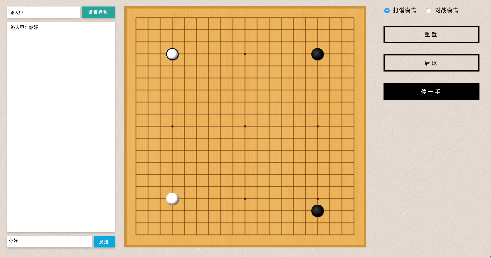
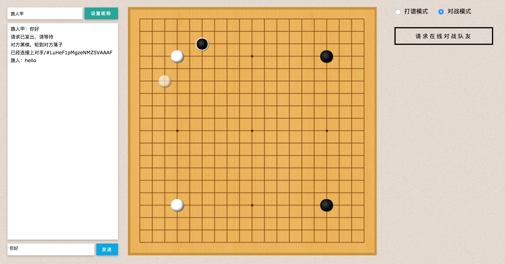
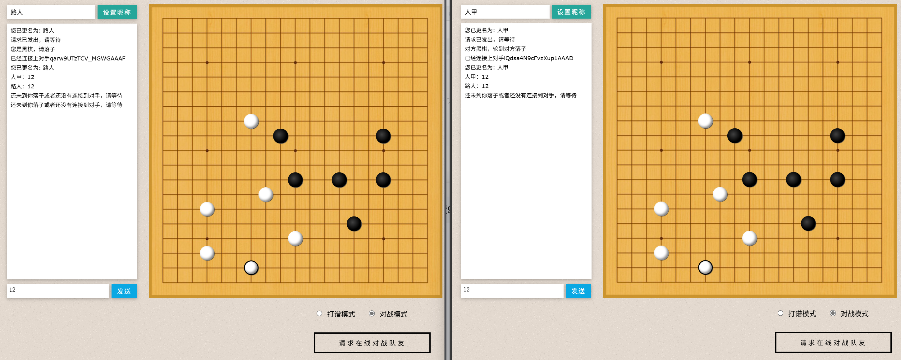

 


## 部署说明

首先感谢原作者的开源。[原项目地址](https://github.com/IreneZhou/Weiqi-Platform)


有需要帮忙部署这个项目的朋友,一杯奶茶,即可程远程帮你部署，需要可联系。  
微信号 `E-0_0-`  
闲鱼搜索用户 `明月人间`  
或者邮箱 `firfe163@163.com`  
如果这个项目有帮到你。欢迎start。

有其他的项目的汉化需求，欢迎提issue。或其他方式联系通知。

### 对战玩法

两人在浏览器中同时打来网页。都选择左下角对战模式，然后两人分别点击`请求在线对战队友`。  
左边的对话框中输出`已经连接上对手`这样的内容就链接好了，然后两人的昵称建议改一下。  
两个人就可以镜像围棋对战了。

### 镜像

从阿里云或华为云镜像仓库拉取镜像，注意填写镜像标签，镜像仓库中没有`latest`标签

容器内部端口 3000

```bash
swr.cn-north-4.myhuaweicloud.com/firfe/weiqi-platform:2025.05.13
```

### docker run 命令部署

```bash
docker run -d \
--name weiqi-platform \
--network bridge \
--restart always \
--log-opt max-size=1m \
--log-opt max-file=3 \
-p 3000:3000 \
swr.cn-north-4.myhuaweicloud.com/firfe/weiqi-platform:2025.05.13
```
### compose 文件部署 👍推荐

```yaml
#version: '3.9'
services:
  weiqi-platform:
    container_name: weiqi-platform
    image: swr.cn-north-4.myhuaweicloud.com/firfe/weiqi-platform:2025.05.13
    network_mode: bridge
    restart: always
    logging:
      options:
        max-size: 1m
        max-file: '3'
    ports:
      - 3000:3000
```

## 修改说明

`./README.md` 文件翻译，增加 `## 部署说明`、`## 修改说明`、`##效果图` 部分。

增加目录 `./图片`  
新增文件 `./.dockerignore`、`./Dockerfile`

## 效果图



## Usage

```
npm install
npm start
```


## Technology

`JavaScript`  `Node.js`  `Express`  `Socket.IO`


## Credit

https://github.com/yutingzhao1991/weiqi 


## TODO

1.  debug: undo没有恢复之前的提子
2.  对战模式停一手
2.  投子认负
3.  确认设置昵称信息
4.  （可选）标出手数
5.  区别开不同类型的信息